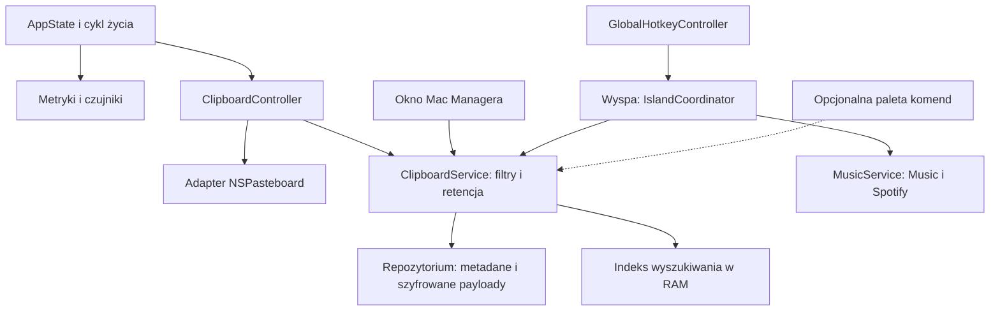

# Mac Manager i TinyCast: stan projektu oraz plan integracji

Data analizy: 2026-09-19. To rekomendacja techniczna i propozycja zakresu, nie zapis zatwierdzenia nowych funkcji ani raport ich wdrożenia.

Aktualizacja po analizie: właściciel wybrał prywatny schowek i pełny moduł wyszukiwania jako kierunek integracji oraz poprosił o dwa scenariusze. Bieżący zakres i porównanie launchera lokalnego z dalszą rozbudową opisuje [osobny dokument](../12-scenariusze-integracji-tinycast.md). Poniższa analiza techniczna pozostaje podstawą; pierwotna rekomendacja ograniczenia się do schowka nie jest już docelowym zakresem.

## Wniosek

Warto adaptować wybrane mechanizmy TinyCast do etapu 3 Mac Managera: obserwację schowka, rozpoznawanie własnych zapisów, zwykłe skróty globalne oraz wybrane rozwiązania obsługi klawiatury i miniatur. Warstwę trwałego zapisu należy zbudować zgodnie z wymaganiami Mac Managera. Pełne włączenie TinyCast oznaczałoby znaczne rozszerzenie produktu o launcher, komendy, rozszerzenia, AI i kolejne integracje.

Etap 2 pozostaje osobnym zadaniem sprzętowym. TinyCast nie dostarcza gotowego odpowiednika naszych temperatur/RPM, wyspy przy notchu ani adapterów Music/Spotify.

## Podstawa analizy i weryfikacja

- Mac Manager: branch `fix/small-improvements`, commit `cef9335`, wersja projektu `0.8.0`, build `8`; drzewo robocze przed analizą było czyste.
- TinyCast: publiczny kod `main`, przypięty do [commita c5cff8cbb9b7e12ac75c058da9573045c76029b7](https://github.com/abue-ammar/tinycast/tree/c5cff8cbb9b7e12ac75c058da9573045c76029b7). Analiza obejmuje rzeczywiste implementacje, nie tylko listę funkcji README.
- W tej sesji: 53 testy `MacManagerCore` i 9 testów `Prototypes/Stage1` przeszły; kompilacja Debug aplikacji dla arm64 przeszła z `CODE_SIGNING_ALLOWED=NO`.
- Środowisko tej sesji: macOS 27.0 (26A428), Xcode 27.0 (27A266a). Minimalny target aplikacji nadal wynosi macOS 26.0. Te wyniki nie zastępują testów na macOS 26.
- Nie uruchamiano ponownie GUI, fizycznych prób sprzętu, testów autostartu ani podpisywania/notaryzacji. Nie uruchamiano TinyCast i jego testów; wnioski o nim pochodzą z przeglądu kodu.
- Logi bieżących sprawdzeń: `/private/tmp/macmanager-audit-core-test.log`, `/private/tmp/macmanager-audit-probe-test.log`, `/private/tmp/macmanager-audit-app-build.log`. Pliki tymczasowe nie są trwałymi artefaktami repozytorium.

## Rzeczywisty stan Mac Managera

Zaimplementowano CPU/GPU/RAM i szacunek mocy AppleSMC PSTR, historię 300 s, sieć IPv4, odwracanie scrolla myszy, okno/pasek menu/Dock/autostart, kontrolę GitHub Releases, diagnostykę oraz PL/EN. `AppState` tworzy po jednej instancji usług, a `ApplicationLifecycleCoordinator` uruchamia je niezależnie od widoczności okna. Lokalny pakiet Core wydziela testowalną logikę. To odpowiednia baza do dodania dalszych modułów.

Etap 1 jest funkcjonalnie zaimplementowany, ale [stan projektu](../10-stan-projektu.md) nadal pozostawia otwarty końcowy odbiór: autostart z instalacji, podpis Developer ID, notaryzację i publiczny DMG. Tytuł commita `9470656` mówi o ukończeniu etapu 1, natomiast raport odbioru i szkic release notes nie potwierdzają zamknięcia tych punktów. Stan wydania należy ustalać z dowodów odbioru, nie z samego tytułu commita. W tej sesji nie potwierdzono zdalnego stanu publikacji.

Historyczny pomiar z 18 września wskazuje średnio 0,413% CPU i 96,81 MB RSS w 602-sekundowej próbie Release przy zamkniętym oknie. To wynik konkretnego builda i urządzenia, nie pomiar wykonany w tej sesji. Szersza macierz Apple Silicon, dodatkowe wyjścia VPN i próba 8-godzinna pozostają ograniczeniami opisanymi w [raporcie kroku 9](etap-1-krok-9a.md).

Nie ma jeszcze usług `SensorService`, `ClipboardService`, `IslandCoordinator` ani `MusicService`. Obecne użycia `NSPasteboard` kopiują IP i diagnostykę; nie stanowią historii schowka. `MetricKind` obejmuje tylko CPU, GPU, pamięć i moc. Adapter C ma odczyt konkretnego klucza PSTR, a nie kompletny katalog czujników.

## Co obejmują etapy 2 i 3

Źródła: [plan i kryteria odbioru](../06-plan-i-testy.md), [wymagania produktu](../01-produkt.md), [dane i prywatność](../05-dane-i-prywatnosc.md).

| Etap | Uzgodniony zakres | Wpływ TinyCast |
| --- | --- | --- |
| 2: czujniki | Temperatura CPU/GPU, °C/°F, każdy fizyczny wentylator i RPM, szczegóły oraz niezależne wskaźniki paska menu. Rozróżnienie 0 RPM, chłodzenia pasywnego i braku odczytu. Bez regulacji wentylatorów i admin helpera. | Brak gotowego modułu do przejęcia. Rozwijamy własne adaptery i walidację modeli. |
| 3: wyspa | Panel przy notchu lub odpowiadającym mu obszarze, rozwijany przez hover i opcjonalny skrót; zwinięty bez treści. Aktywny ekran MacBooka, w przeciwnym razie ekran główny; domyślnie ukryty na pełnym ekranie. | Wzorce `NSPanel`, klawiatury i oddawania fokusu są przydatne. Pozycjonowanie, hover i reguły ekranów wymagają własnego koordynatora. |
| 3: schowek | Trwała lokalna historia tekstów/obrazów, wyszukiwanie, przywrócenie i ręczne ⌘V; pauza, wykluczenia, znaczniki poufności; domyślnie 50 wpisów, 7 dni, 200 MB. Szyfrowanie treści i miniatur. | Największy obszar wspólny, ale z istotnymi różnicami zapisu, retencji i interakcji. |
| 3: muzyka | Lokalne Apple Music/Spotify: utwór, wykonawca, okładka, postęp i podstawowe sterowanie; osobne zgody Automatyzacji. | Własne adaptery. Odtwarzacz podglądu pliku w TinyCast nie zastępuje integracji z Music/Spotify. |

Wspólny obszar oznacza tu lokalną historię systemowego schowka na jednym Macu. Obecny plan wyklucza synchronizację historii między urządzeniami. Synchronizacja byłaby odrębną zmianą produktu; systemowy Universal Clipboard nie jest współdzieloną bazą historii obu aplikacji.

## Co konkretnie adaptować

Wszystkie poniższe ścieżki odnoszą się do wskazanego commita TinyCast. Nie jest to gotowy pakiet SwiftPM z publicznym API, tylko kod wewnętrzny aplikacji.

| Kod źródłowy TinyCast | Przydatność i wymagane dostosowanie |
| --- | --- |
| `Features/Clipboard/Service/ClipboardManager.swift` | Punkt wyjścia dla pollingu co 500 ms, znacznika własnych zapisów, pomijania treści poufnych i ponownego ustawiania bazowego licznika po wznowieniu. Wydzielić zależności od `AppSettings`/`ClipboardStore`; dodać nasze zgody, retencję, walidację i cykl życia. |
| `Features/HotKeys/Service/HotKeyCenter.swift`, `KeyShortcut.swift` | Zwykłe kombinacje globalne oparte na Carbon, rejestracja/wyrejestrowanie i pauza podczas nagrywania skrótu. Zwracać błąd konfliktu do UI; obecny kod tylko loguje nieudaną rejestrację. Dodać jawne sprzątanie do cyklu życia Mac Managera. |
| `Features/HotKeys/Service/ShortcutCaptureSession.swift`, UI recordera | Zachowanie nagrywania skrótu po ograniczeniu zależności i dopasowaniu PL/EN. Nie potrzeba całego `HotKeyManager`, Hyper Key ani monitorowania podwójnych modyfikatorów do jednego skrótu wyspy. |
| `Platform/Images/ImageThumbnail.swift` i cache miniatur | Wzorzec skalowania przez ImageIO oraz limitu pamięci. U nas wejściem powinny być odszyfrowane bajty w RAM, bez tworzenia jawnego tymczasowego PNG na dysku. |
| `Palette/PalettePanel.swift`, `PaletteWindowController.swift` | Referencja dla interakcji klawiatury, IME i fokusu. Nie kopiować całych kontrolerów: są zależne od `AppCore`, `PaletteState` i pozostałych funkcji launchera. |
| `Features/Launcher/Model/SearchRelevance.swift` | Dobry kandydat do adaptacji dopiero przy wyborze launchera. Dla 50 tekstów schowka wystarczy wyszukiwanie w RAM; ranking aplikacji nie jest konieczny. |
| `Tests/pasteboard-test.swift`, `clipboard-test.swift`, `hotkey-test.swift` | Przydatne scenariusze, m.in. izolowany pasteboard i dane syntetyczne. Przenieść wybrane zachowania do testów naszej implementacji, zmieniając oczekiwania niezgodne z produktem. |

Nie przenosić całego `AppCore` ani `AppDelegate`, drugiego menu bar, autostartu, systemu aktualizacji i magazynu ustawień. Mac Manager już ma właścicieli tych odpowiedzialności. Pełny `AppIndex` też nie jest małym, niezależnym skanerem aplikacji: reprezentuje m.in. komendy, rozszerzenia, spotkania i ustawienia.

## Dlaczego schowek nie nadaje się do skopiowania bez zmian

| Obszar | TinyCast w badanym kodzie | Wymaganie Mac Managera / działanie |
| --- | --- | --- |
| Poufność na dysku | `ClipboardStore` zapisuje tekst i źródłowy bundle ID w SQLite, tekstowy indeks FTS5, obrazy w zwykłych plikach PNG. | Nowe repozytorium: AES-GCM dla treści/miniatur, lokalny klucz w Keychain, w SQLite wyłącznie dopuszczone metadane; indeks treści w RAM. |
| Retencja | Domyślnie 90 dni; opcja bezterminowa; przypięte wpisy nie wygasają. Okno 1000 wpisów w RAM nie jest limitem historii na dysku. | Egzekwować niezależnie liczbę, wiek i bajty; domyślnie 50/7 dni/200 MB. Brak nieuzgodnionych wyjątków dla przypięć. |
| Przywrócenie | Domyślna akcja wkleja przez syntetyczne ⌘V. `Paster.write` promuje wpis i może zmienić jego datę. | Wyłącznie przywrócenie do schowka i ręczne ⌘V; zachować pierwotną datę i termin wygaśnięcia. |
| Zakres zapisu | Historia domyślnie włączona, obsługuje tekst/obraz/pliki; kolejność preferuje plik, następnie tekst i obraz. OCR jest osobną opcją. | Aktywacja przy konfiguracji, tylko tekst/obraz, obraz preferowany przy wielu reprezentacjach. Pliki i OCR poza przyjętym zakresem. |
| Filtrowanie | `ConcealedType`, `TransientType`, `com.apple.is-sensitive`; wykluczenie według aktywnej aplikacji. | Dodać `AutoGeneratedType`, konserwatywne uwzględnienie zadeklarowanego źródła i wykluczeń; nadal bez obietnicy wykrycia każdego hasła. |
| Spójność odczytu | Poller ustawia licznik przed odczytem payloadu; brak ponownego porównania licznika na końcu tej ścieżki. | Ponownie sprawdzić `changeCount` i odrzucić niespójny odczyt. |
| Wznowienie / zadania asynchroniczne | Są obserwatory aktywności sesji i reset bazowego licznika; obrazy trafiają do zadań detached. | Sprawdzić lock/unlock i sleep/wake; generacja/anulowanie ma uniemożliwić późny zapis obrazu po pauzie, wyłączeniu lub czyszczeniu historii. |
| Błędy bazy | `open()` po nieudanym otwarciu usuwa bazę, WAL i SHM, po czym próbuje utworzyć nową. | Błąd lub brak klucza nie może automatycznie usuwać zdrowej historii ani przełączać zapisu na plaintext. |
| Lokalność przywracania | `Paster` używa `clearContents`, bez `currentHostOnly`. | Nasz adapter zapisu ma używać `currentHostOnly` po walidacji prototypu P05. |

Ponadto należy dodać uzgodnione limity pojedynczego payloadu i wymiarów obrazu, okresowe czyszczenie także podczas pauzy oraz obsługę pełnego dysku i przerwanego zapisu. TinyCast wykonuje część operacji SQLite na MainActor; naszą warstwę dyskową warto umieścić na serializowanym executorze poza UI.

## Proponowana architektura

Jeden proces Mac Managera, jedna instancja usługi schowka i jedno repozytorium. Okno, wyspa i ewentualna przyszła paleta komend konsumują ten sam stan. Nie należy otwierać produkcyjnej bazy TinyCast jako współdzielonego magazynu ani tworzyć drugiego pollera dla wyspy.

Proponowany podział: modele/retencja w `Packages/MacManagerCore`, adapter pasteboardu i koordynator w `MacManager/Platform/Clipboard`, widoki w `MacManager/Features/Clipboard`, osobny `Platform/Hotkeys` i `Platform/Island`. Zapis, odszyfrowanie i przygotowanie obrazów nie mogą blokować głównego aktora. Usługi uruchamia cykl życia procesu, a nie pojawienie się widoku.

## Zalecana kolejność

1. Uzgodnić z dowodami faktyczny stan końcowego odbioru etapu 1. Otwarte czynności dystrybucyjne nie są techniczną zależnością samego projektowania kolejnych modułów.
2. Zrealizować etap 2: wydzielić odczyt SMC, katalog zweryfikowanych czujników i dekodowanie formatów, dodać `SensorDescriptor`/odczyty wielu czujników oraz agregacje CPU/GPU/RPM. Korzystać ze wspólnego harmonogramu i serializować dostęp do adaptera. Sprawdzić model z wentylatorami i Air, °C/°F, niedostępność, sleep/wake oraz narzut.
3. Otworzyć etap 3 prototypami P05/P06/P07 na danych syntetycznych. Sprawdzić dostęp do schowka na minimalnym i aktualnym macOS, działanie `currentHostOnly`, fokus/hover/ekrany i lokalne odtwarzacze.
4. Zbudować panel i obsługę ekranów oraz usługę schowka z szyfrowanym repozytorium. Adaptować małe mechanizmy TinyCast z przypiętego commita. Dostarczyć wyszukiwanie i przywracanie w oknie; wyspa korzysta z tego samego serwisu.
5. Dodać skrót, retencję i pełne stany błędów; przejść T12-T16/T19, w tym brak jawnej treści na dysku, własne zapisy, pauzę, lock/unlock, brak klucza i przerwany zapis.
6. Podłączyć Music/Spotify do wspólnej wyspy. Zakończyć testami T10-T11/T17/T20-T21, pomiarem tła, pamięci przy dużych obrazach i regresją scrolla.
7. Launcher aplikacji/komend rozważyć jako jawne rozszerzenie po podstawowym etapie 3. Wówczas adaptować wyszukiwanie i skanowanie aplikacji, a komendy Mac Managera kierować do istniejących usług.

Kolejność zachowuje obecne etapy. Przyspieszenie schowka przed czujnikami jest technicznie możliwe, ale zmienia priorytety uzgodnionego planu. Nie wynika automatycznie z analizy zgodności TinyCast.

## Warianty zakresu

| Wariant | Ocena |
| --- | --- |
| Schowek + skrót + elementy obsługi panelu | Rekomendowany punkt startowy. Najlepiej pokrywa istniejący etap 3; największa własna praca to bezpieczny zapis i reguły retencji. |
| Powyższe + launcher aplikacji i komend Mac Managera | Sensowne rozszerzenie produktu: jedno wyszukiwanie aplikacji, schowka i naszych akcji. Wymaga dodatkowych ekranów, rankingu, skrótów i testów. |
| Większość TinyCast | Osobny duży program integracji. AI, rozszerzenia, kalendarz, kamera, komendy shell i aktualizator poszerzają zależności, uprawnienia i przepływy danych. Sam fakt wspólnego SwiftUI nie czyni takiego połączenia prostym. |

Właściciel następnie wskazał schowek i cały moduł wyszukiwania. Porównanie dwóch aktualnych scenariuszy i ich wpływ na etapy znajduje się w [dokumencie zakresu](../12-scenariusze-integracji-tinycast.md). Włączenie funkcji w aplikacji pozostaje pracą implementacyjną.

## Licencja i utrzymanie

Mac Manager deklaruje AGPL-3.0-only. [Nagłówek licencji TinyCast](https://github.com/abue-ammar/tinycast/blob/c5cff8cbb9b7e12ac75c058da9573045c76029b7/LICENSE) dopuszcza AGPL v3 lub późniejszą, więc adaptację można oprzeć na wersji 3. To zgodny kierunek licencyjny dla naszego projektu.

Przy faktycznym przeniesieniu kodu zachować informacje o autorze i licencji, oznaczyć zmodyfikowane pliki oraz udostępniać odpowiedni kod źródłowy zgodnie z AGPL przy dystrybucji. Uzupełnić `THIRD_PARTY_NOTICES.md` i zasób dołączany do aplikacji o pliki, commit źródłowy i zakres adaptacji. Dotychczasowe informacje Apache-2.0 dla Scroll Reversera pozostają. Osobno sprawdzić licencje kopiowanych zasobów; samo AGPL nie obejmuje wszystkich znaków marek wymienionych w [NOTICE.md TinyCast](https://github.com/abue-ammar/tinycast/blob/c5cff8cbb9b7e12ac75c058da9573045c76029b7/NOTICE.md).

Adaptowane pliki powinny mieć rejestr pochodzenia i lokalnych zmian. Aktualizacje TinyCast przeglądać selektywnie; nie podpinać jego ruchomego `main` jako automatycznej zależności i nie dziedziczyć całego zestawu entitlements.

## Źródła kodu TinyCast

- [Przechwytywanie schowka](https://github.com/abue-ammar/tinycast/blob/c5cff8cbb9b7e12ac75c058da9573045c76029b7/Tinycast/Features/Clipboard/Service/ClipboardManager.swift)
- [Magazyn SQLite, retencja i wyszukiwanie](https://github.com/abue-ammar/tinycast/blob/c5cff8cbb9b7e12ac75c058da9573045c76029b7/Tinycast/Features/Clipboard/Model/ClipboardStore.swift)
- [Przywracanie i automatyczne wklejanie](https://github.com/abue-ammar/tinycast/blob/c5cff8cbb9b7e12ac75c058da9573045c76029b7/Tinycast/Features/Clipboard/Service/Paster.swift)
- [Globalne skróty](https://github.com/abue-ammar/tinycast/blob/c5cff8cbb9b7e12ac75c058da9573045c76029b7/Tinycast/Features/HotKeys/Service/HotKeyCenter.swift)
- [Właściciel usług aplikacji](https://github.com/abue-ammar/tinycast/blob/c5cff8cbb9b7e12ac75c058da9573045c76029b7/Tinycast/App/AppCore.swift)
- [Konfiguracja targetów](https://github.com/abue-ammar/tinycast/blob/c5cff8cbb9b7e12ac75c058da9573045c76029b7/project.yml)
